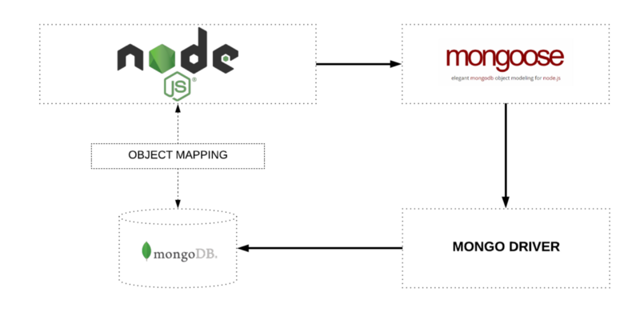

# Blog Api Project

## Used technologies & Methods:
* Node.Js
* Express.Js
* Mongoose - MongoDB SQL
* Object Mapping (ORM)
* Password Crypto
* Cookies / Session

-----

### ER (Entity Relationship Diagram) Diagram


### Node.js - Mongoose structure in the project


### Steps to be taken before running the project.

```
- The project is downloaded from the github repo.
- After the project is opened in VSCode, the following commands are run from the gitBash terminal.

$ npm init -y
$ npm i express dotenv express-async-errors
$ npm i mongoose
$ echo PORT=8000 > .env
$ echo MONGODB=mongodb://127.0.0.1:27017/blogApi >> .env
$ cp ./env-sample ./.env
$ $ npm i cookie-session
$ nodemon // * Running *

- The synchronization function in line 40 of the index.js file should be run once and disabled again.
- Testing is done with the following URL queries via Thunder Client or Postman.
```

### Folder/File Structure:

```
    src/
        controllers/
            blogController.js
            userController.js
        helpers/
        passwordEncrypt.js
        img/
            erdBlogApi.png
            mongoose.png
        middlewares/
            findSearchSortPage.js
        models/
            blogModel.js
            userModel.js
        routes/
            blogRoute.js
            userRoute.js
        dbConnection.js
        errorHandler.js
        sync.js
    .gitignore
    .env-sample
    index.js
    package-lock.json
    package.json    
    Readme.md
```
### Resources used
* https://mongoosejs.com/docs/queries.html
* http://expressjs.com/en/resources/middleware/cookie-session.html
* https://www.npmjs.com/package/cookie-session
* https://nodejs.org/api/crypto.html#cryptopbkdf2syncpassword-salt-iterations-keylen-digest
* https://www.mongodb.com/docs/manual/reference/operator/query/regex/

> Designed By DOGUKAN © Nov 2023